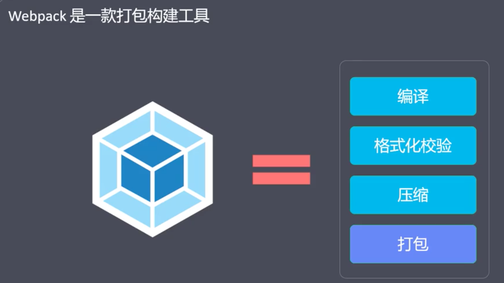
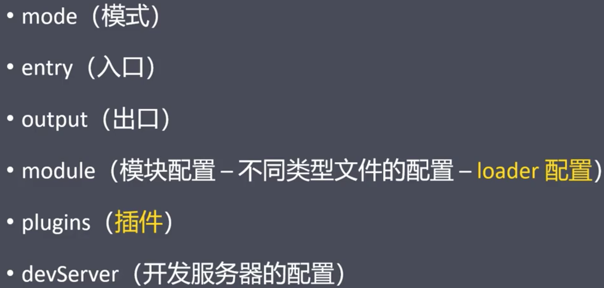
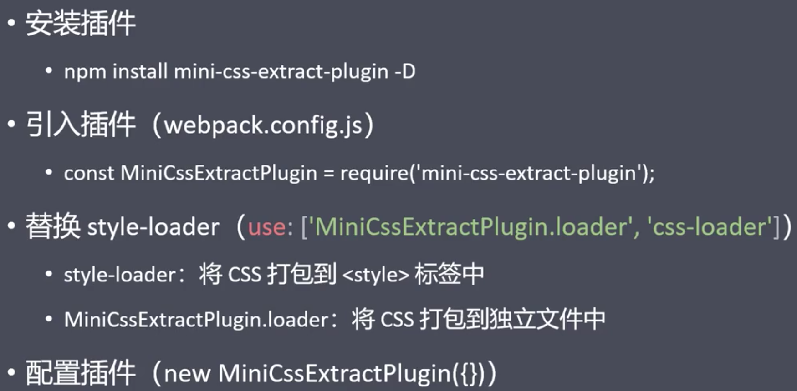
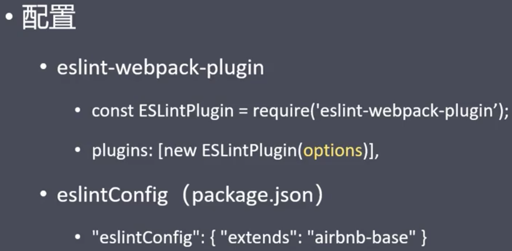

#### 【webpack】

#### 1、Webpack概述

**webpack** 是一个用于现代 JavaScript 应用程序的 ***静态模块打包工具***

模块：模块化开发，可以提高开发效率，避免重复造轮子（相当于飞机的零件）

打包：将各个模块按照一定的规则组装起来（相当于飞机）


构建（转换）：把不支持的代码，转成支持的代码，确保浏览器兼容性


打包：把多个js文件合并为一个，减少http请求次数


Webpack是一款打包构建工具



#### 2、Webpack核心概念

7个

- 入口（Entry）

  打包时第一个被访问的源码文件

  默认是src/index.js（可以通过配置文件指定）

  Webpack通过入口，加载整个项目的依赖

  

- 出口（Output）

  打包后，输出的文件名称

  默认是dist/main.js（可以通过配置文件指定）

  

- 加载器（Loader）

  专门用来处理一类文件（非JS）的工具

  - Webpack默认只能识别JS，想要处理其他类型的文件，需要对应的loader

  命名方式：xxx-loader

  

- 插件（Plugins）

  实现loader之外的其他功能，比如压缩

  命名方式：xxx-webpack-plugin

  Loader和Plugin本质上都是npm包

  

- 模式（Mode）

  用来区分环境的关键字

  - 不同环境的打包逻辑不同，因此需要区分

    比如，开发环境下不需要压缩，生产环境下需要，需要把这两个环境区分开

  - 三种模式

    - development（自动优化打包速度，添加一些调试过程中的辅助） 
    - production（自动优化打包结果）
    - none（运行最原始的打包，不做任何额外处理）

  

- 模块（Module）

  Webpack中一切皆为模块

  

- 依赖图（Dependency Graph）

  

#### 3、Webpack最佳实践


#### 4、Webpack配置文件

- 用来简化命令行选项

  - 配置前打包构建命令如上
  - 配置后：Webpack

- 默认的配置文件名称是webpack.config.js

  - 是以CommonJS规范进行组织的
  - 使用Webpack的过程，大部分就是跟配置文件打交道的过程

- 配置文件详情

  **webpack 的配置文件是 JavaScript 文件，文件内导出了一个 webpack [配置对象](https://webpack.docschina.org/configuration/)。** webpack 会根据该配置定义的属性进行处理。

  

```javascript
/**
* Webpack的配置文件
*/

const {resolve} = require('path');

module.exports = {
    // 打包模式
    mode:'development',
    // mode:'production',
    // 入口文件
    entry:'./src/index.js',
    // 出口配置
    output:{
        // 输出目录（输出目录必须是绝对路径）
        path:resolve(__dirname,'dist'),
        // 输出文件名字
        filename:'main.js'
    },
    // 模块配置
    module:{
        rules:[
            // 指定多个配置规则
        ]
    },
    // 插件配置
    plugins:[],
    // 开发服务器
    devServer:{}

};
```

#### 5、打包CSS

##### 1）普通CSS打包基本逻辑


```javascript
 // 1.针对CSS文件的规则
            {
                test:/\.css$/i,
                use:[
                    // 执行顺序；先下后上
                    // 'style-loader',

                    // 若想打包成独立的CSS文件，用mini-css-extract-plugin替换style-loader
                    // css代码被抽成一个独立的文件，需要单独引入
                    // MiniCssExtractPlugin.loader,
                    {
                        loader:MiniCssExtractPlugin.loader,
                        options:{
                            // 打包后的CSS文件存储在dist/css/main.css，结合CSS和图片打包后输出位置，为背景图片设置正确路径
                            // publicPath:'../images/'   // 为背景图片指定路径
                        }
                    },
                    'css-loader',
                    // 将css打包转化成js之前，应添加前缀适配不同的浏览器
                    'postcss-loader'
                ]
            }
```

##### 2）less


```javascript
// 2.针对less文件的规则
            {
                test:/\.less$/i,
                use:[
                    MiniCssExtractPlugin.loader,
                    'css-loader',
                    'postcss-loader',
                    'less-loader'
                ],
            }
```

##### 3）将css打包成独立的文件



##### 4）添加样式前缀

新的样式属性有兼容性问题

针对不同的浏览器添加不同的前缀


##### 5）校验CSS代码和格式


##### 6）压缩CSS


```javascript
// ******************** 打包CSS
        // 1.配置【打包独立CSS文件】插件，可以指定输出目录、文件名等
        new MiniCssExtractPlugin({
            // 根据出口配置，默认已经在dist文件夹下，设置输出文件名称
            filename:'css/main.css'
        }),
        // 2.配置【CSS格式校验】插件，可以指定校验文件等
        new StylelintPlugin({
            // 指定校验文件,默认在项目根目录下
            files:['src/css/*.{css,less,sass,scss}']
        }),
        // 3.配置【压缩CSS】插件
        new OptimizeCssAssetsPlugin(),
```

#### 6、打包HTML

##### 1）基本逻辑

打包一个/多个html文件


#### 7、打包JS

##### 1）JS转译

将ES6+转成ES5，从而保证JS在低版本浏览器的兼容性


##### 2）格式校验




#### 7、打包图片（难点）

##### 1）对js和css文件中的图片打包


  base64


##### 2）对html页面插入的图片打包


#### 8、打包字体

  

#### 9、资源模块（assets module）

webpack5里新引入的

无需配置额外的loader


```javascript
// webpack5中使用资源模块处理字体、图片文件
                // asset可以在asset/resource 和 asset/inline 之间进行选择
                // 如果文件小于8kb，则使用asset/inline类型
                // 如果文件大于8kb，则使用asset/resource类型
                type:'asset',
                parser:{
                    dataUrlCondition:{
                        maxSize:8*1024
                    }
                },
                generator:{
                    filename:'fronts/[name][ext]'
                }
```

#### 10、Dev Server


```javascript
// 开发服务器
    devServer:{
        // 指定加载内容的路径
        contentBase:resolve(__dirname,'dist'),
        // 启用gzip压缩
        compress:true,
        // 端口号
        port:9000,
        // 启动自动更新（禁用hot）
        inline : true,

        // 配置代理，解决接口跨域问题
        proxy:{
            // 接口的请求路径
            // 相当于 http://localhost:9000/api
            '/api':{
                // 配置访问api时应该指向的内容
                // http://localhost:9000 => https://api.github.com
                // http://localhost:9000/api/users => https://api.github.com/api/users
                target:'https://api.github.com',
                // 上述接口路径多了一个api,需进行路径的映射
                // http://localhost:9000/api/users => https://api.github.com/users
                pathRewrite:{
                    '^/api':""
                },
                // 不能使用localhost:9000作为GitHub的主机名，改变域名
                changeOrigin:true
            }
        }
    },
    // 配置目标
    target:'web'
```

【问题】注意webpack-cli与webpack-dev-server的版本

【web前端热更新讲解】https://www.jianshu.com/p/1352a69a8344


Dev-server默认加载的是内存中的数据

【dev-server的跨域问题】


