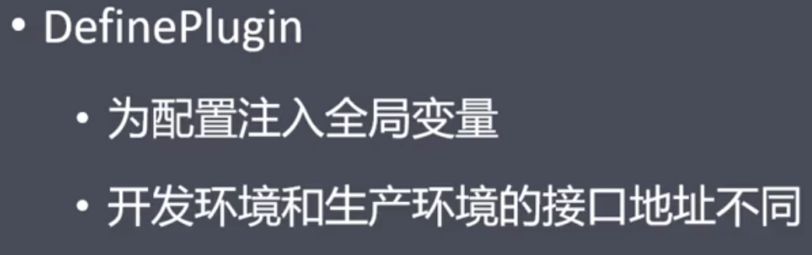
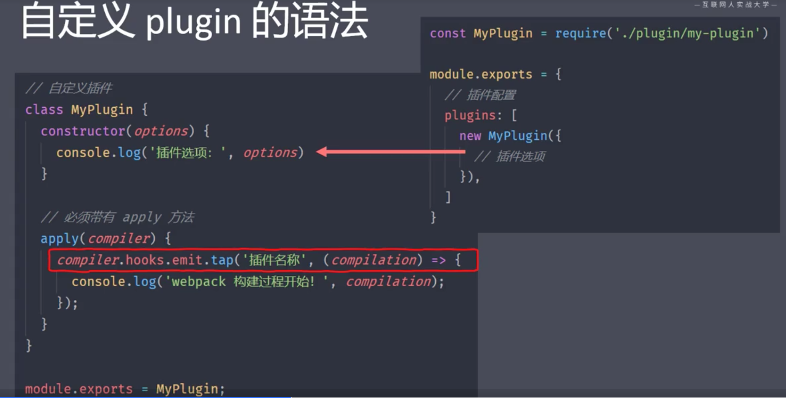
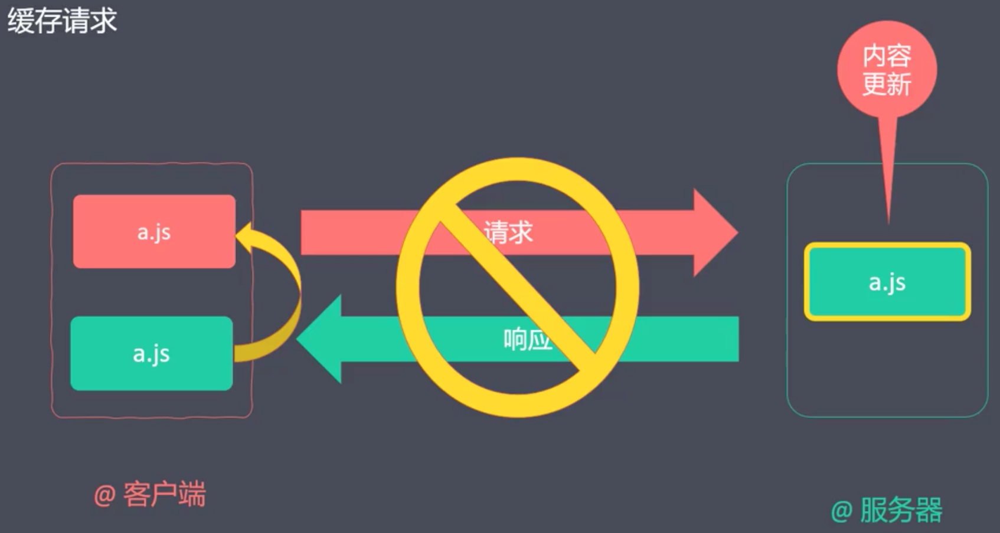

#### 1、区分打包环境

开发/生产

测试/真实


##### 1）通过环境变量区分


##### 2）通过配置文件区分


##### 3）其它




#### 2、自定义plugin

##### 1）Webpack是基于插件机制的


##### 2）Webpack常用钩子


##### 3）自定义插件语法



```javascript
const { Compilation } = require("webpack");

// 声明自定义插件
class MyPlugin{
    constructor(options){
        console.log('插件配置选项',options);
        this.userOptions = options || {};
    }
    // 必须声明apply方法
    apply(compiler){
        // 在钩子上挂载功能
        compiler.hooks.emit.tap('MyPlugin',compilation => {
            // compilation此次打包的上下文
            for(const name in compilation.assets){
                console.log(name);
                // 针对CSS文件做一些操作：删除注释
                if(name.endsWith(this.userOptions.target)){
                    // 获取处理之前的内容
                    const contents = compilation.assets[name].source();
                    // 将原来的内容通过正则表达式，删除注释
                    const nocommments =  contents.replace(/\/\*[\s\S]*?\*\//g,'');
                    // 将处理后的结果，替换掉
                    compilation.assets[name] = {
                        source:() => nocommments,
                        size:() => nocommments.length
                    }
                }
            }
        });
    }
}

module.exports = MyPlugin;

```

#### 3、自定义loader


##### 1）一个loader处理


```javascript
const marked = require('marked');
const {getOptions} = require('loader-utils');


// loader本质是一个ES module模块，它导出一个函数，在函数中对打包资源进行转换
// 导出函数时建议使用普通函数，而不使用箭头函数（拿不到配置项）
module.exports = function(source){
    // 获取loader的配置项
    const options = getOptions(this);
    console.log('myLoader的配置项',options);

    const html = marked(source);

    // 返回必须是一段JS代码
    // return "console.log('编译时输出my loader')"

    // "<h1 id="readme">readme</h1><p>webpack之自定义loader学习</p>"
    // 直接返回，可能因为引号的问题报错
    // return `module.export = "${html}"`
    // return `module.export = ${JSON.stringify(html)}`

    // 直接返回html，交给下一个loader处理
    return html;
}
```

##### 2）多个loader处理


#### 4、代码分离


##### 1）多入口打包


##### 2）提取公共模块


##### 3）动态导入


浏览器的network检查效果

#### 5、源码映射source map


 .map文件

本质是一个json文件，包含source-map版本、转换前文件名称、转换前变量/函数名称、映射关系字符串、源码内容等

##### 1）映射模式


#### 6、tree shaking


##### 1）usedExports


##### 2）sideEffects


#### 7、缓存


再次构建时只打包更改的文件，其它读取缓存


再次请求相同文件，直接调用本地缓存，解决高并发问题



不同hash值对应不同的粒度


#### 8、模块解析 resolve


#### 9、排除依赖


#### 10、模块联邦

Module Federation是为了解决独立应用之间代码共享问题。可以在项目内动态加载其他项目的代码，同步可以共享依赖。


